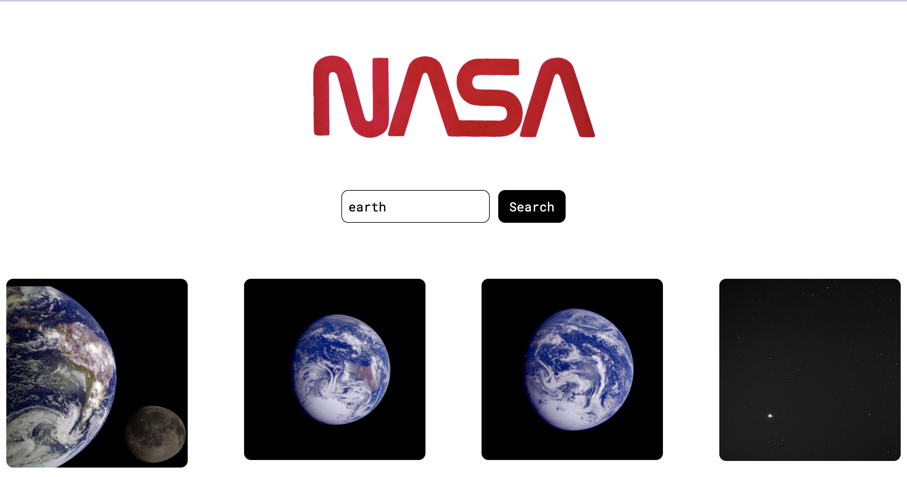

# Technical Test

 

I completed this mock technical test as a project for Command Shift bootcamp. The brief was to create a React app that allows users to enter keywords and returns the relevant images.

Built with: React.
Testing utilities: Jest and React Testing Library.
Packages used: Axios.

Actions I would have completed with more time:
- Added CSS styling to make the layout of the images more uniform.
- Made the app responsive for tablet and mobile screens.
- Deployed the app.

## Getting started

- Create a fork of this repo.
- Copy the fork's git address and clone to your machine using `git clone`. 
- Use `npm install` to download the dependencies.
- Use `npm test` to run the tests.
- Use `npm start` to run the app in your browser.

Author: Camilla Priest-Stephens

